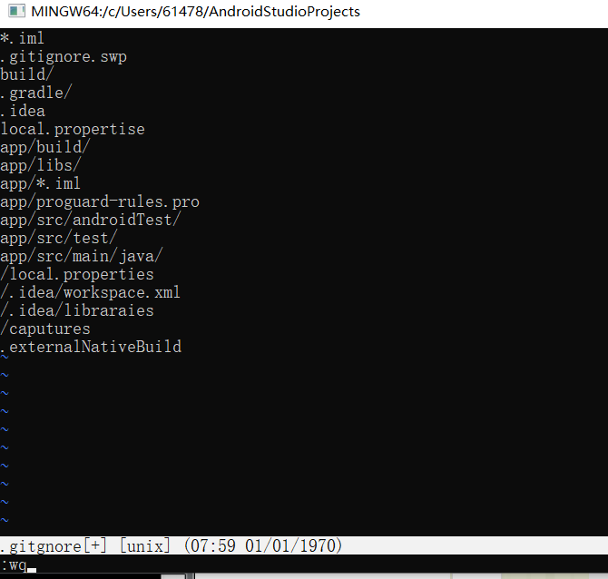
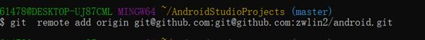
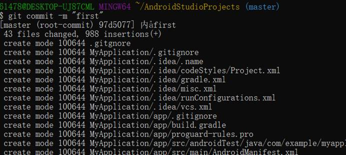

# 实验一

### 实验前提：

- 下载安装android studio和git
- 拥有Github账号
- 建立android studio项目

### 实验步骤：

##### 1.配置用户身份

打开Git Bash，输入以下两行命令，告诉Github你的身份

```
git config --global user.name "Github账户名称"
git config --global user.email "Github账户邮箱"
```

##### 2.创建本地仓库

打开项目本地文件右键，点击Git Bash，输入命令，创建本地仓库

```
git init
```


##### 3.编写.gitgnore

项目中的有些文件根本没必要上传，这时候我们就要用到.gitgnore文件

在Git Bash中输入命令

```
vim .gitgnore
```

向.gitgnore中写入避免文件



编写完成保存

##### 4.创建远程仓库

打开github主页,NEW一个仓库

创建完成,点击SSH

##### 5.从本地仓库上传项目到Github仓库

在Git Bash中输入命令，添加远程库(":"后为用户名和仓库名)

```
git  remote add origin git@github.com:zwlin2/android.git
```

[

跟踪当前目录下所有文件(除.gitgnore中忽略文件)

```
git add .
```

将本地暂存的修改提交到版本库

```
git commit -m "内容描述"
```



推送到远程仓库

```
git push origin master 
```

##### 6.查看Github


推送成功

