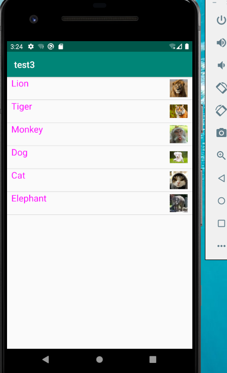
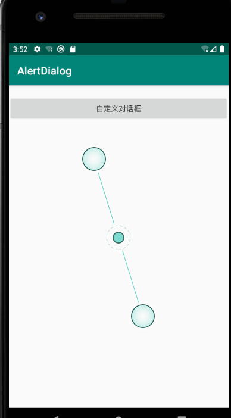
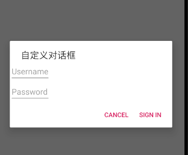
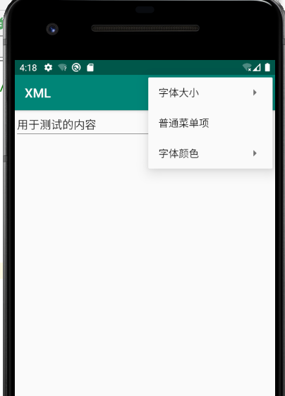
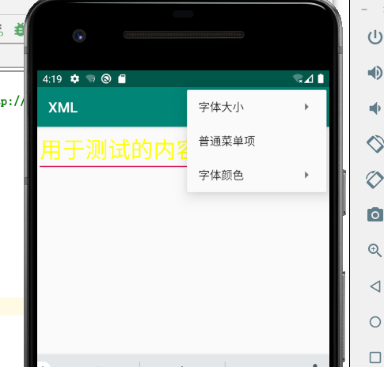
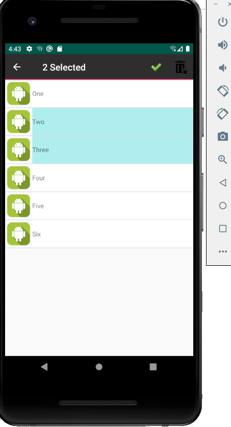

# 实验三       

## Android ListView的用法

activity_main.xml

```
<?xml version="1.0" encoding="utf-8"?>
<androidx.constraintlayout.widget.ConstraintLayout xmlns:android="http://schemas.android.com/apk/res/android"
    android:orientation="horizontal"
    android:layout_width="match_parent"
    android:layout_height="match_parent">
    <!--定义一个listview -->
    <ListView
        android:id="@+id/mylist"
        android:layout_width="match_parent"
        android:layout_height="match_parent" />
</androidx.constraintlayout.widget.ConstraintLayout>
```

simple_item.xml

```
<?xml version="1.0" encoding="utf-8"?>
<LinearLayout xmlns:android="http://schemas.android.com/apk/res/android"


    android:orientation="horizontal"
    android:layout_width="match_parent"
    android:layout_height="match_parent">
    <!--总的布局是横向的  -->
    <!--定义一个imageview，作为列表项的一部分  图片位于右边 -->


    <!--再定义一个textview ,用于作为列表项的一部分 -->
    <TextView android:id="@+id/name"
        android:layout_width="wrap_content"
        android:layout_height="wrap_content"
        android:layout_weight="1"
        android:paddingLeft="10dp"
        android:textColor="#f0f"
        android:textSize="20sp"/>

    <ImageView android:id="@+id/header"
        android:layout_width="50dp"
        android:layout_height="50dp"
        android:layout_gravity="right"
        android:paddingRight="10dp"/>

</LinearLayout>
```

MainActivity.java

```
package com.example.test3;

import androidx.appcompat.app.AppCompatActivity;
import android.os.Bundle;
import android.view.Gravity;
import android.view.View;
import android.widget.AdapterView;
import android.widget.ListView;
import android.widget.SimpleAdapter;
import android.widget.Toast;
import java.util.ArrayList;
import java.util.HashMap;
import java.util.List;
import java.util.Map;


public class MainActivity extends AppCompatActivity {
    private String[] names = new String[]
            {"Lion","Tiger","Monkey","Dog","Cat","Elephant"};
    private int[] ImageIds = new int[]{R.drawable.lion,R.drawable.tiger,
            R.drawable.monkey, R.drawable.dog,R.drawable.cat,R.drawable.elephant};
    @Override
    protected void onCreate(Bundle savedInstanceState) {
        super.onCreate(savedInstanceState);
        setContentView(R.layout.activity_main);
        List<Map<String,Object>> listItems = new ArrayList<>();
        for (int i=0;i<names.length;i++)
        {
            Map<String, Object> listItem = new HashMap<>();
            listItem.put("name",names[i]);
            listItem.put("header",ImageIds[i]);
            listItems.add(listItem);
        }
        SimpleAdapter simpleAdapter = new SimpleAdapter(this,listItems,R.layout.simple_item,
                new String[]{"name","header"},new int[]{R.id.name,R.id.header});
        ListView list = findViewById(R.id.mylist);
        list.setAdapter(simpleAdapter);
        list.setOnItemClickListener(new AdapterView.OnItemClickListener()
        {
            @Override
            public void onItemClick(AdapterView<?> parent, View view, int position, long id) {
                System.out.println(names[position] + "被单击了");
                //居中
                Toast toastCenter = Toast.makeText(getApplicationContext(),names[position],Toast.LENGTH_LONG);
                toastCenter.setGravity(Gravity.CENTER,0,0);
                toastCenter.show();


            }
            public void onNothingSelected(AdapterView<?> parent)
            {
            }
        });


    }
}

```

结果




## 创建自定义布局的AlertDialog

activity_main.xml

```
<?xml version="1.0" encoding="utf-8"?>

<TableLayout xmlns:android="http://schemas.android.com/apk/res/android"
    android:orientation="vertical"
    android:layout_width="match_parent"
    android:layout_height="match_parent">

    <TextView
        android:id="@+id/show"
        android:layout_height="wrap_content"
        android:layout_width="match_parent"/>
    <Button
        android:id="@+id/button"
        android:layout_height="wrap_content"
        android:layout_width="match_parent"
        android:onClick="customView"
        android:text="自定义对话框" />

</TableLayout>
```

login.xml

```
<?xml version="1.0" encoding="utf-8"?>
<TableLayout xmlns:android="http://schemas.android.com/apk/res/android"
    android:orientation="vertical" android:layout_width="match_parent"
    android:layout_height="match_parent">
    <TableRow>
        <EditText
            android:layout_width="match_parent"
            android:layout_height="wrap_content"
            android:hint="Username"
            android:selectAllOnFocus="true" />
    </TableRow>
    <TableRow>

        <EditText
            android:layout_width="match_parent"
            android:layout_height="wrap_content"
            android:hint="Password"
            android:inputType="textPassword"/>
    </TableRow>
</TableLayout>

```

MainActivity.java

```
package com.example.alertdialog;

import androidx.appcompat.app.AppCompatActivity;
import android.os.Bundle;
import android.app.AlertDialog;
import android.view.View;
import android.widget.TableLayout;
import android.widget.TextView;

public class MainActivity extends AppCompatActivity {
    private TextView show;


    @Override
    protected void onCreate(Bundle savedInstanceState) {
        super.onCreate(savedInstanceState);
        setContentView(R.layout.activity_main);
        show = findViewById(R.id.show);
    }
    public void customView(View source)
    {


        TableLayout  logininfo ;
        logininfo     = (TableLayout) getLayoutInflater().inflate(R.layout.login, null);

        new AlertDialog.Builder(this)
                //设置对话框标题
                .setTitle("自定义对话框")
                //设置对话框对象
                .setView(logininfo)
                //设置一个确认按钮
                .setPositiveButton("Sign in", (dialog, which) -> {show.setText("登陆");
                })
                //设置一个取消按钮
                .setNegativeButton("Cancel", (dialog, which) -> {show.setText("取消");
                })
                .create().show();
    }
}
```

运行结果：





## 使用XML定义菜单

activity_main.xml

```
<?xml version="1.0" encoding="utf-8"?>
<androidx.constraintlayout.widget.ConstraintLayout xmlns:android="http://schemas.android.com/apk/res/android"
    xmlns:app="http://schemas.android.com/apk/res-auto"
    xmlns:tools="http://schemas.android.com/tools"
    android:layout_width="match_parent"
    android:layout_height="match_parent"
    tools:context=".MainActivity">

    <EditText
        android:id="@+id/aaa"
        android:layout_width="match_parent"
        android:layout_height="wrap_content"
        android:text="用于测试的内容"
        tools:ignore="MissingConstraints" />

</androidx.constraintlayout.widget.ConstraintLayout>
```

MainActivity.java

```
package com.example.xml;

import androidx.appcompat.app.AppCompatActivity;
import android.os.Bundle;
import android.graphics.Color;
import android.view.Menu;
import android.view.MenuItem;
import android.view.SubMenu;
import android.widget.EditText;
import android.widget.Toast;

public class MainActivity extends AppCompatActivity {

    final int FONT_10 = 0x111;
    final int FONT_16 = 0x112;
    final int FONT_20 = 0x113;

    //定义普通菜单的标识
    final int PLAIN_ITEM = 0x11b;
    //定义颜色菜单项的标识
    final int FONT_RED = 0x114;
    final int FONT_BLACK = 0x115;
     final int FONT_YELLOW = 0x0000ffff;
    private EditText edit;
    @Override
    protected void onCreate(Bundle savedInstanceState) {
        super.onCreate(savedInstanceState);
        setContentView(R.layout.activity_main);
        edit = findViewById(R.id.aaa);
    }
    @Override
    public boolean onCreateOptionsMenu(Menu menu)
    {
        //------------像menu添加字体大小的子菜单----------
        SubMenu fontMenu = menu.addSubMenu("字体大小");
        fontMenu.setHeaderIcon(R.drawable.cat);
        fontMenu.setHeaderIcon(R.drawable.cat);
        fontMenu.setHeaderTitle("选择字体大小");
        fontMenu.add(0,FONT_10,0,"10号字体");
        fontMenu.add(0, FONT_16, 0, "16号字体");
        fontMenu.add(0, FONT_20, 0, "20号字体");
        //添加普通菜单项
        menu.add(0, PLAIN_ITEM, 0, "普通菜单项");
        //选择字体的颜色
        SubMenu colorMenu = menu.addSubMenu("字体颜色");
        colorMenu.setHeaderTitle("选择文字颜色");
        colorMenu.add(0, FONT_RED, 0, "红颜色");
        colorMenu.add(0, FONT_BLACK, 0, "黑颜色");
        colorMenu.add(0, FONT_YELLOW, 0, "黄颜色");
        return super.onCreateOptionsMenu(menu);
    }
    @Override
    public boolean onOptionsItemSelected(MenuItem mi){
        switch (mi.getItemId())
        {
            case FONT_10: edit.setTextSize(10 * 2);	break;
            case FONT_16: edit.setTextSize(16 * 2); break;
            case FONT_20: edit.setTextSize(20 * 2); break;
            case FONT_RED: edit.setTextColor(Color.RED); break;
            case FONT_BLACK:edit.setTextColor(Color.BLACK); break;
             case FONT_YELLOW:edit.setTextColor(Color.YELLOW); break;
            case PLAIN_ITEM:
                Toast toast = Toast.makeText(MainActivity.this, "您单击了普通菜单项", Toast.LENGTH_LONG);
                toast.show();
                break;
        }
        return true;
    }
}

```

运行结果：






## 创建上下文操作模式(ActionMode)的上下文菜单


AdapterCur.java

```
package com.example.test302;

import android.content.Context;
import android.graphics.Color;
import android.view.View;
import android.view.ViewGroup;
import android.widget.BaseAdapter;
import android.widget.ImageView;
import android.widget.TextView;
import java.util.List;

public class AdapterCur extends BaseAdapter {

    List<Item> list;
    Context context;

    public AdapterCur(List<Item> list, Context context) {
        this.context = context;
        this.list = list;
        notifyDataSetChanged();
    }

    public int getCount() {
        return list.size();
    }

    public Item getItem(int position) {
        return list.get(position);
    }

    public long getItemId(int position) {
        return 0;
    }

    public View getView(final int position, View convertView, ViewGroup parent) {

        final ViewHolder viewHolder;
        if(convertView==null){
            convertView=View.inflate(context, R.layout.activity_content, null);
            viewHolder=new ViewHolder();
            viewHolder.imageView = convertView.findViewById(R.id.image);
            viewHolder.textView = convertView.findViewById(R.id.text_view);
            convertView.setTag(viewHolder);
        }else{
            viewHolder=(ViewHolder) convertView.getTag();
        }

        int PaleTurquoise = Color.parseColor("#AFEEEE");
        int white = Color.parseColor("#FFFFFF");
        viewHolder.textView.setText(list.get(position).getName());
        if(list.get(position).isBo() == true){
            viewHolder.textView.setBackgroundColor(PaleTurquoise);
            viewHolder.imageView.setBackgroundColor(PaleTurquoise);
        }
        else {
            viewHolder.textView.setBackgroundColor(white);
            viewHolder.imageView.setBackgroundColor(white);
        }
        return convertView;
    }
    class ViewHolder{
        ImageView imageView;
        TextView textView;
    }
}
```

Item.java

```
package com.example.test302;

public class Item {
    private String name;
    private boolean bo;

    public Item(String name, boolean bo){
        super();
        this.name = name;
        this.bo = bo;
    }
    public String getName() {
        return name;
    }

    public boolean isBo() {
        return bo;
    }
    public void setBo(boolean bo) {
        this.bo = bo;
    }
    @Override
    public String toString() {
        return "Item{" + "name='" + name + '\'' + ",bo=" + bo + '}';
    }
}

```

MainActivity.java

```
package com.example.test302;

import androidx.appcompat.app.AppCompatActivity;
import android.os.Bundle;
import android.view.ActionMode;
import android.view.Menu;
import android.view.MenuInflater;
import android.view.MenuItem;
import android.widget.AbsListView;
import android.widget.BaseAdapter;
import android.widget.ListView;
import java.util.ArrayList;
import java.util.List;

public class MainActivity extends AppCompatActivity {

    private ListView listView;
    private List<Item> list;

    private BaseAdapter adapter;
    private String [] name = {"One","Two","Three","Four","Five","Six"};

    @Override
    protected void onCreate(Bundle savedInstanceState) {
        super.onCreate(savedInstanceState);
        setContentView(R.layout.activity_main);

        listView = findViewById(R.id.list_view);
        list = new ArrayList<Item>();
        for(int i = 0; i < 6; i++){
            list.add(new Item(name[i], false));
        }
        adapter = new AdapterCur(list,MainActivity.this);
        listView.setAdapter(adapter);

        listView.setChoiceMode(ListView.CHOICE_MODE_MULTIPLE_MODAL);
        listView.setMultiChoiceModeListener(new AbsListView.MultiChoiceModeListener() {
            int num = 0;

            @Override
            public void onItemCheckedStateChanged(ActionMode mode, int position, long id, boolean checked) {

                if (checked == true) {
                    list.get(position).setBo(true);
                    adapter.notifyDataSetChanged();
                    num++;
                } else {
                    list.get(position).setBo(false);
                    adapter.notifyDataSetChanged();
                    num--;
                }
                mode.setTitle("  " + num + " Selected");
            }

            @Override
            public boolean onCreateActionMode(ActionMode mode, Menu menu) {
                MenuInflater inflater = mode.getMenuInflater();
                inflater.inflate(R.menu.activity_action_mode, menu);
                num = 0;
                adapter.notifyDataSetChanged();
                return true;
            }

            @Override
            public boolean onPrepareActionMode(ActionMode mode, Menu menu) {

                adapter.notifyDataSetChanged();
                return false;
            }

            public void refresh(){
                for(int i = 0; i < 6; i++){
                    list.get(i).setBo(false);
                }
            }

            @Override
            public boolean onActionItemClicked(ActionMode mode, MenuItem item) {
                switch (item.getItemId()) {
                    case R.id.menu_all:
                        num = 0;
                        refresh();
                        adapter.notifyDataSetChanged();
                        mode.finish();
                        return true;
                    case R.id.menu_delete:
                        adapter.notifyDataSetChanged();
                        num = 0;
                        refresh();
                        mode.finish();
                        return true;
                    default:
                        refresh();
                        adapter.notifyDataSetChanged();
                        num = 0;
                        return false;
                }

            }

            @Override
            public void onDestroyActionMode(ActionMode mode) {
                refresh();
                adapter.notifyDataSetChanged();
            }

        });
    }
}

```

activity_content.xml

```
<?xml version="1.0" encoding="utf-8"?>
<LinearLayout
    xmlns:android="http://schemas.android.com/apk/res/android"
    android:layout_width="match_parent"
    android:layout_height="wrap_content">
    <ImageView
        android:id="@+id/image"
        android:layout_width="50dp"
        android:layout_height="50dp"
        android:layout_margin="5dp"
        android:src="@drawable/robot" />

    <TextView
        android:id="@+id/text_view"
        android:layout_width="match_parent"
        android:layout_height="60dp"
        android:gravity="center_vertical" />

</LinearLayout>
```

activity_main.xml

```
<?xml version="1.0" encoding="utf-8"?>
<LinearLayout
    xmlns:android="http://schemas.android.com/apk/res/android"
    android:layout_width="match_parent"
    android:layout_height="match_parent"
    android:orientation="vertical">

    <ListView
        android:id="@+id/list_view"
        android:layout_width="match_parent"
        android:layout_height="match_parent"
        android:choiceMode="multipleChoiceModal"/>
</LinearLayout>
```

运行结果：




