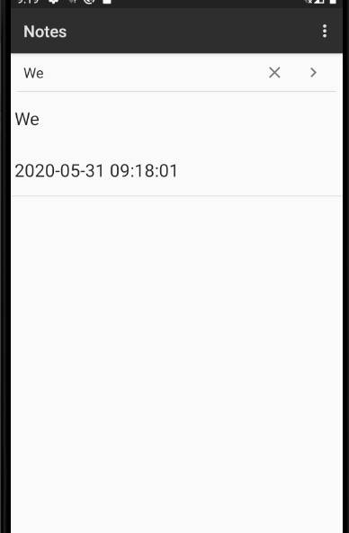

##  NoteList中显示条目增加时间戳显示

1.效果图：


2.代码

（1）将布局文件noteslist_item.xml的布局修改为垂直布局，并添加一个TextView来显示时间戳：

```
<LinearLayout
    xmlns:android="http://schemas.android.com/apk/res/android"
    android:orientation="vertical"
    android:layout_width="match_parent"
    android:layout_height="wrap_content">
  
  <TextView xmlns:android="http://schemas.android.com/apk/res/android"
       android:id="@android:id/text1"
       android:layout_width="match_parent"
       android:layout_height="?android:attr/listPreferredItemHeight"
       android:textAppearance="?android:attr/textAppearanceLarge"
       android:gravity="center_vertical"
       android:paddingLeft="5dip"
       android:singleLine="true"
    />
    <TextView xmlns:android="http://schemas.android.com/apk/res/android"
        android:id="@android:id/text2"
        android:layout_width="match_parent"
        android:layout_height="?android:attr/listPreferredItemHeight"
        android:textAppearance="?android:attr/textAppearanceLarge"
        android:gravity="center_vertical"
        android:paddingLeft="5dip"
        android:singleLine="true"
        />
</LinearLayout>
```

(2)在NoteList.java的PROJECTION数组中增加时间戳字段，对SimpleCursorAdapter中的参数viewsIDs增加时间戳布局组建的ID，对参数dataColumns增加对应字段：

```
  private static final String[] PROJECTION = new String[] {
            NotePad.Notes._ID, // 0
            NotePad.Notes.COLUMN_NAME_TITLE, // 1
            NotePad.Notes.COLUMN_NAME_MODIFICATION_DATE, //时间戳（修改时间）
    };
String[] dataColumns = { NotePad.Notes.COLUMN_NAME_TITLE ,NotePad.Notes.COLUMN_NAME_MODIFICATION_DATE} ;
int[] viewIDs = { android.R.id.text1,android.R.id.text2};
```

(3)在NoteEditor.java文件中添加dataToStr函数来显示格式化时间，并找到updateNote函数将格式化时间存入数据库当中：

```
public String dateToStr(){
        Date date = new Date();
        SimpleDateFormat simpleDateFormat = new SimpleDateFormat("yyyy-MM-dd HH:mm:ss");
        return simpleDateFormat.format(date);
    }
values.put(NotePad.Notes.COLUMN_NAME_MODIFICATION_DATE, dateToStr());
```

## 用笔记标题做为关键字的搜索功能

1.效果图：



2.代码分析：

（1）把NoteList.java文件修改为继承Activity类，并在布局文件中实现自定义的ListView:

```
public class NotesList extends Activity 
```

（2）新建listview.xml布局文件创建ListView存放数据内容，添加SearchView组件实现搜索功能。：

```
<?xml version="1.0" encoding="utf-8"?>
<LinearLayout
    android:layout_width="match_parent"
    android:layout_height="match_parent"
    android:orientation="vertical"
    xmlns:android="http://schemas.android.com/apk/res/android">
    <android.widget.SearchView
        android:id="@+id/search"
        android:layout_width="match_parent"
        android:layout_height="wrap_content"
        >
    </android.widget.SearchView>

    <ListView
        android:id="@+id/tv"
        android:layout_width="match_parent"
        android:layout_height="match_parent"/>
</LinearLayout>
```

(3)为ListView的列表项绑定监听事件：

```
// Sets the ListView's adapter to be the cursor adapter that was just created.
        listView.setAdapter(adapter);
        // 为ListView的列表项的单击事件绑定事件监听器
        listView.setOnItemClickListener(new AdapterView.OnItemClickListener() {
            @Override
            public void onItemClick(AdapterView<?> parent, View view, int position, long id) {
                // Constructs a new URI from the incoming URI and the row ID
                Uri uri = ContentUris.withAppendedId(getIntent().getData(), id);

                // Gets the action from the incoming Intent
                String action = getIntent().getAction();

                // Handles requests for note data
                if (Intent.ACTION_PICK.equals(action) || Intent.ACTION_GET_CONTENT.equals(action)) {

                    // Sets the result to return to the component that called this Activity. The
                    // result contains the new URI
                    setResult(RESULT_OK, new Intent().setData(uri));
                } else {

                    // Sends out an Intent to start an Activity that can handle ACTION_EDIT. The
                    // Intent's data is the note ID URI. The effect is to call NoteEdit.
                    startActivity(new Intent(Intent.ACTION_EDIT, uri));
                }
            }
        });
```

(4)实现Search函数来实现搜索功能，实现搜索的基本思路是新建一个Cursor游标，通过SearchView搜索的字段在数据库进行模糊搜索来装配数据，并在ListView中即时显示，在onCreate调用该函数：

```
private void SearchView(){
        mSearchView=findViewById(R.id.search);
        // a display model
        mSearchView.onActionViewExpanded();
        //default display
        mSearchView.setQueryHint("搜索笔记");
        //display submit button
        mSearchView.setSubmitButtonEnabled(true);
        //implement SearchView TextListener
        mSearchView.setOnQueryTextListener(new SearchView.OnQueryTextListener() {
            // when text has been submitted
            @Override
            public boolean onQueryTextSubmit(String s) {
                return false;
            }
            // when text is changing
            @Override
            public boolean onQueryTextChange(String s) {
                if(!s.equals("")){
                    String selection=NotePad.Notes.COLUMN_NAME_TITLE+" GLOB '*"+s+"*'";//query selection condition
                    updatecursor = getContentResolver().query(
                            getIntent().getData(),            // Use the default content URI for the provider.
                            PROJECTION,                       // Return the note ID and title for each note.
                            selection,                             // No where clause, return all records.
                            null,                             // No where clause, therefore no where column values.
                            NotePad.Notes.DEFAULT_SORT_ORDER  // Use the default sort order.
                    );
                }
                else {
                    updatecursor = getContentResolver().query(
                            getIntent().getData(),            // Use the default content URI for the provider.
                            PROJECTION,                       // Return the note ID and title for each note.
                            null,                             // No where clause, return all records.
                            null,                             // No where clause, therefore no where column values.
                            NotePad.Notes.DEFAULT_SORT_ORDER  // Use the default sort order.
                    );
                }
                // change adapter from SimpleCursorAdapter cursor
                adapter.swapCursor(updatecursor);
                // adapter.notifyDataSetChanged();
                return false;
            }
        });
    }
```